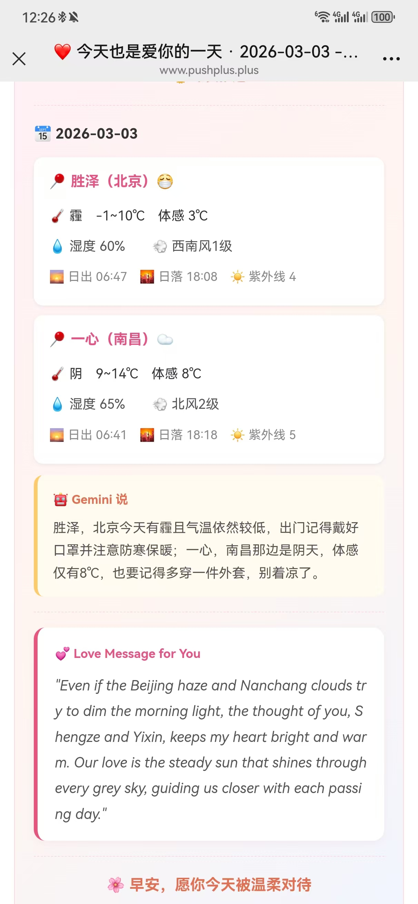
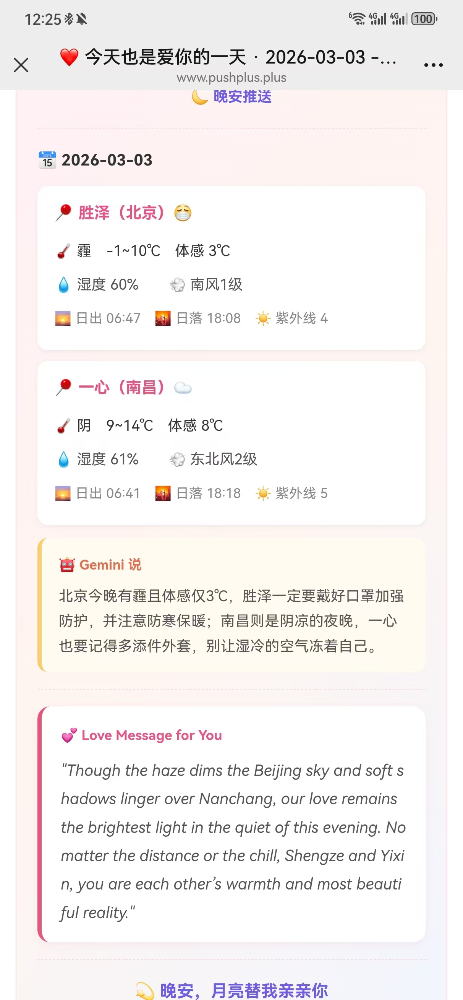

# 微信每日天气推送 💌 WeChat Daily Weather Push

<p align="center">
  
  
  
</p>

每天自动向微信推送 **天气 + AI 点评 + 英语情话**，支持多城市、早晚安双推。

Automatically push **weather + AI commentary + love messages** to WeChat daily, with multi-city support and morning/evening modes.

---

<!-- 📸 效果图 / Screenshots -->
<!-- 把你的截图放在 docs/public/images/ 文件夹中，然后取消下方注释 -->
<!-- Place your screenshots in docs/public/images/ folder, then uncomment below -->

<!-- 
<p align="center">
  
  &nbsp;&nbsp;&nbsp;
  
</p>
-->

> 🖼️ **效果图占位** — 截图后替换上面的注释即可 / **Screenshot placeholder** — replace the comments above with your images

---

## 📐 架构 / Architecture

```
┌─────────────────────────────────────────────────┐
│                   main.py                       │
│          (入口 / Entry Point)                    │
│      解析参数 → 调度推送 → 定时模式               │
├──────────┬──────────┬──────────┬────────────────┤
│          │          │          │                │
│  config  │ weather  │  love    │     push       │
│  .py     │ .py      │ _message │     .py        │
│          │          │  .py     │                │
│ 读取配置  │ 获取天气  │ Gemini   │  PushPlus     │
│ .env /   │ 和风天气  │ 生成情话  │  微信推送      │
│ 环境变量  │ + 备用源  │ + 点评   │  HTML 构建     │
└──────────┴──────────┴──────────┴────────────────┘
```

| 模块 / Module | 职责 / Role |
|---|---|
| `config.py` | 读取 `.env` 或系统环境变量，加载城市配置 / Load config from `.env` or env vars |
| `weather.py` | 和风天气 API（主） + 中国天气网（备用） / QWeather API (primary) + China Weather (fallback) |
| `love_message.py` | Gemini AI 生成天气点评 + 英语情话 / Gemini AI generates commentary + love messages |
| `push.py` | 构建 HTML 消息 + PushPlus 推送 / Build HTML message + PushPlus delivery |
| `main.py` | CLI 入口：单次推送 / 定时模式 / Entry: single push or scheduled mode |

---

## 🚀 推送方式 / Push Methods

### 方式一：本地手动运行 / Local Manual Run

```bash
# 安装依赖 / Install dependencies
pip install -r requirements.txt

# 复制配置 / Copy config
copy .env.example .env   # 然后编辑 .env 填入你的 API Key

# 早安推送 / Morning push
python main.py --mode morning

# 晚安推送 / Evening push
python main.py --mode evening

# 本地定时模式（需保持运行）/ Local scheduled mode (keep running)
python main.py --schedule
```

### 方式二：GitHub Actions 手动触发 / GitHub Actions Manual Trigger

1. 进入仓库 → **Actions** → **Daily Weather Push**
2. 点 **Run workflow** → 选择 `morning` 或 `evening` → 运行
3. 适合测试和随时推送

<!-- 📸 GitHub Actions 手动触发截图占位 -->
<!-- 
<p align="center">
  
</p>
-->

### 方式三：GitHub Actions 定时触发（推荐）/ Scheduled (Recommended)

代码推送到 GitHub 后自动按时运行，无需本地电脑：

| 时间 / Time | 模式 / Mode | Cron (UTC) |
|---|---|---|
| 每天 07:30 (北京) | 🌞 早安 morning | `30 23 * * *` |
| 每天 22:00 (北京) | 🌙 晚安 evening | `0 14 * * *` |

配置步骤：

1. 在 GitHub → **Settings** → **Secrets and variables** → **Actions** 添加以下 Secrets：

| Secret Name | 说明 / Description |
|---|---|
| `PUSHPLUS_TOKEN` | PushPlus 推送 Token |
| `PUSHPLUS_TOPIC` | 群组编码（可选）/ Group code (optional) |
| `GEMINI_API_KEY` | Gemini API Key |
| `GEMINI_MODEL` | 模型名 / Model name (e.g. `gemini-3-flash-preview`) |
| `QWEATHER_API_KEY` | 和风天气 API Key / QWeather API Key |
| `QWEATHER_API_HOST` | 和风天气 Host / QWeather Host |

2. 推送代码到 GitHub，定时任务自动生效

<!-- 📸 GitHub Secrets 配置截图占位 -->
<!-- 
<p align="center">
  
</p>
-->

---

## 📁 项目结构 / Project Structure

```
微信天气/
├── .env                  # 本地配置（不上传）/ Local config (git-ignored)
├── .env.example          # 配置模板 / Config template
├── .github/
│   └── workflows/
│       └── schedule.yml  # GitHub Actions 定时任务 / Scheduled workflow
├── config.py             # 配置读取 / Config loader
├── weather.py            # 天气模块 / Weather module
├── love_message.py       # Gemini 情话生成 / AI love message generator
├── push.py               # 推送模块 / Push module  
├── main.py               # 主程序 / Main entry
├── requirements.txt      # 依赖 / Dependencies
├── docs/                 # 📖 文档网站 / Documentation site
│   └── ...
└── README.md
```

---

## 🛠️ API 获取 / Get API Keys

| 服务 / Service | 地址 / URL | 说明 / Note |
|---|---|---|
| PushPlus | [pushplus.plus](https://www.pushplus.plus/) | 微信扫码登录，首页复制 Token |
| 和风天气 | [dev.qweather.com](https://dev.qweather.com/) | 注册 → 创建应用 → 复制 Key |
| Gemini | [aistudio.google.com](https://aistudio.google.com/apikey) | 获取 API Key（可选，不配则用经典情话库） |

---

## 📖 文档 / Documentation

详细文档请访问 / For detailed docs, visit:

🔗 **[在线文档 / Online Docs](https://huangshengzebluesky.github.io/Wechat_Weather/)**

---

## 💕 License

MIT
